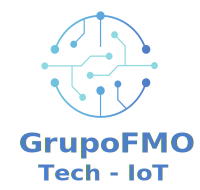

# Grupo FMO - Landing Page Corporativo

<p align="center">
  
</p>

Sitio web corporativo profesional para **Grupo FMO - Consultores e Integradores Tecnológicos**, empresa especializada en soluciones tecnológicas con Software Libre, IoT, Inteligencia Artificial y desarrollo de software a medida.

---

## 📋 Tabla de Contenidos

1. [Descripción del Proyecto](#descripción-del-proyecto)
2. [Arquitectura del Sistema](#arquitectura-del-sistema)
3. [Tecnologías Empleadas](#tecnologías-empleadas)
4. [Estructura del Proyecto](#estructura-del-proyecto)
5. [Secciones del Sitio](#secciones-del-sitio)
6. [Clientes](#clientes)
7. [Servicios](#servicios)
8. [Características Técnicas](#características-técnicas)
9. [Diseño Responsivo](#diseño-responsivo)
10. [SEO y Metadatos](#seo-y-metadatos)
11. [Rendimiento](#rendimiento)
12. [Accesibilidad](#accesibilidad)
13. [Configuración y Despliegue](#configuración-y-despliegue)
14. [Mantenimiento](#mantenimiento)
15. [Contacto](#contacto)

---

## 📝 Descripción del Proyecto

**Grupo FMO** es una empresa ecuatoriana líder en consultoría e integración tecnológica, especializada en:

- Implementación de herramientas y tecnologías basadas en Software Libre
- Despliegue de servidores físicos y virtuales
- Migraciones de sistemas
- Desarrollo de software a medida
- Consultorías tecnológicas
- Soluciones de IoT (Internet de las Cosas)
- Inteligencia Artificial
- Servicios en la nube

El landing page corporativofue diseñado para proyectar una imagen profesional, moderna y confiable, destacando la experiencia de la empresa y sus casos de éxito con clientes de sectores educativos y gubernamentales.

---

## 🏗️ Arquitectura del Sistema

```
┌─────────────────────────────────────────────────────────────┐
│                    LANDING PAGE ESTÁTICO                    │
├─────────────────────────────────────────────────────────────┤
│                                                              │
│  ┌──────────────┐   ┌──────────────┐   ┌──────────────┐    │
│  │   HEADER     │   │    HERO       │   │   SERVICES   │    │
│  │  Navigation  │   │   Section    │   │    Section   │    │
│  └──────────────┘   └──────────────┘   └──────────────┘    │
│                                                              │
│  ┌──────────────┐   ┌──────────────┐   ┌──────────────┐    │
│  │    ABOUT     │   │   CLIENTS     │   │   CONTACT    │    │
│  │   Section    │   │   Section     │   │    Section   │    │
│  └──────────────┘   └──────────────┘   └──────────────┘    │
│                                                              │
├─────────────────────────────────────────────────────────────┤
│                         FOOTER                               │
└─────────────────────────────────────────────────────────────┘
```

### Modelo de Capas

| Capa | Descripción |
|------|-------------|
| **Contenido** | HTML5 semántico con estructura lógica |
| **Presentación** | CSS3 con variables, Grid, Flexbox |
| **Interactividad** | JavaScript ES6+ sin dependencias externas |
| **Assets** | Imágenes optimizadas SVG, fuentes web |

---

## 🛠️ Tecnologías Empleadas

### Frontend

| Tecnología | Versión | Propósito |
|------------|---------|-----------|
| HTML5 | Estándar | Estructura semántica del documento |
| CSS3 | Estándar | Estilos, animaciones, diseño responsivo |
| JavaScript | ES6+ | Interactividad y lógica del cliente |
| SVG | Estándar | Gráficos vectoriales escalables |

### Recursos Externos

| Recurso | Proveedor | Propósito |
|---------|-----------|-----------|
| **Inter** | Google Fonts | Tipografía principal |
| **JetBrains Mono** | Google Fonts | Código y elementos técnicos |
| **Font Awesome 6.5.1** | CDNJS | Iconos vectoriales |

### Herramientas de Desarrollo

- **Editores**: VS Code, cualquier editor de texto
- **Navegadores**: Chrome, Firefox, Safari, Edge (últimas versiones)
- **Servidor local**: Python simplehttp, PHP built-in, Node.js

---

## 📁 Estructura del Proyecto

```
webgrupofmo/
│
├── index.html                 # Página principal (524 líneas)
│
├── assets/
│   ├── css/
│   │   └── styles.css         # Hoja de estilos principal (1089 líneas)
│   │
│   ├── js/
│   │   └── main.js            # JavaScript principal (555 líneas)
│   │
│   ├── images/
│   │   ├── Logo_FMO_Imagen_Texto_Celeste.svg  # Logo corporativo
│   │   ├── logo-white.svg    # Logo para fondo oscuro
│   │   ├── favicon.svg       # Favicon del sitio
│   │   ├── logo.svg          # Logo alternativo
│   │   ├── grupo-fmo-og.jpg  # Imagen para Open Graph
│   │   └── placeholder.svg    # Imagen de relleno
│   │
│   └── fonts/                 # Directorio para fuentes locales
│
├── sw.js                      # Service Worker (PWA)
│
├── .gitignore                 # Configuración Git
│
├── LICENSE                    # Licencia del proyecto
│
└── README.md                  # Este archivo
```

---

## 🎯 Secciones del Sitio

### 1. Header (Cabecera)
- Logo corporativo con imagen y texto
- Navegación principal con 5 enlaces
- Menú hamburguesa para dispositivos móviles
- Altura: 90px (desktop), 70px (móvil)
- Diseño fijo con efecto scroll

### 2. Hero Section
- Título principal animado con efecto typing
- Subtítulo descriptivo de servicios
- Llamadas a acción (CTA) duales
- Grid visual de tecnologías (Linux, Docker, Git, Python, Node.js, AWS)
- Fondo con gradiente y partículas animadas

### 3. Servicios
Se presentan 6 servicios principales:

| # | Servicio | Icono | Descripción |
|---|----------|-------|-------------|
| 1 | Desarrollo Web/Móvil | `fa-code` | Aplicaciones web y móviles modernas |
| 2 | Consultoría e Integración | `fa-server` | Implementación de proyectos con Software Libre |
| 3 | Internet de las Cosas (IoT) | `fa-network-wired` | Sensores, recolección y análisis de datos |
| 4 | Inteligencia Artificial | `fa-brain` | Machine Learning y Deep Learning |
| 5 | Ciberseguridad | `fa-shield-alt` | Auditorías y protección de infraestructura |
| 6 | Capacitación y Soporte | `fa-graduation-cap` | Talleres y soporte técnico 24/7 |

### 4. Sobre Nosotros
- Descripción de la empresa y experiencia
- Estadísticas animadas (años, proyectos, clientes)
- Stack tecnológico con badges visuales

### 5. Clientes
- 5 casos de éxito con tarjetas visuales
- Iconos representativos por sector
- Descripción del servicio prestado
- Enlaces directos a los sitios web

### 6. Contacto
- Información de contacto (email, teléfono, ubicación)
- Formulario de contacto con validación
- Selector de tipo de servicio
- Redes sociales

### 7. Footer
- Logo en versión blanca
- Enlaces a servicios, empresa y recursos
- Información de derechos reservados

---

## 👥 Clientes

El sitio web showcasing los siguientes clientes:

| # | Cliente | Sector | Servicios | Enlace |
|---|---------|--------|-----------|--------|
| 1 | Unidad Educativa Cristo Rey | Educación | Infraestructura de red, tecnologías y servicios | cristorey.edu.ec |
| 2 | ITSUP | Educación Superior | Migración a la nube, soporte integral | itsup.edu.ec |
| 3 | GAD - Sucre | Gobierno | Servicios en la nube, aplicaciones municipales | sucre.gob.ec |
| 4 | Patronato del GAD - Sucre | Gobierno | Sistemas de gestión social | patronato.sucre.gob.ec |
| 5 | Oficina de Turismo | Gobierno | Sistemas de información turística | turismo.sucre.gob.ec |

---

## 💼 Servicios

### Desarrollo Web/Móvil
- Aplicaciones web progresivas
- Apps móviles multiplataforma
- E-commerce y CMS personalizados
- APIs RESTful

### Consultoría e Integración
- Análisis de requisitos
- Arquitectura de soluciones
- Implementación de Software Libre
- Migraciones de sistemas

### Internet de las Cosas (IoT)
- Diseño de sensores
- Redes de comunicación IoT
- Dashboard de visualización
- Análisis de datos en tiempo real

### Inteligencia Artificial
- Modelos predictivos
- Procesamiento de lenguaje natural
- Visión por computadora
- Automatización inteligente

### Ciberseguridad
- Auditorías de seguridad
- Implementación de firewalls
- Gestión de vulnerabilidades
- Backup y recuperación

### Capacitación y Soporte
- Talleres técnicos
- Documentación completa
- Soporte 24/7
- Mantenimiento preventivo

---

## ⚙️ Características Técnicas

### Diseño Visual
- **Paleta de Colores**:
  - Primario: `#2563eb` (Azul)
  - Secundario: `#10b981` (Verde esmeralda)
  - Acento: `#f59e0b` (Ámbar)
  - Gradiente: `linear-gradient(135deg, #667eea 0%, #764ba2 100%)`

- **Tipografía**:
  - Principal: Inter (300-700 weights)
  - Código: JetBrains Mono

- **Espaciado**: Sistema de diseño con múltiplos de 4px

- **Sombras**: Escalera de sombras (sm, md, lg, xl, 2xl)

- **Border Radius**: 4px, 8px, 12px, 16px

### Interactividad
- Animaciones CSS3 (transform, transition, animation)
- Efectos hover en todos los elementos interactivos
- Scroll suave entre secciones
- Menú lateral (drawer) para móviles
- Validación de formularios en tiempo real
- Contadores animados en sección "Sobre Nosotros"

---

## 📱 Diseño Responsivo

### Breakpoints

| Dispositivo | Ancho | Altura Header | Logo |
|-------------|-------|---------------|------|
| Desktop | ≥1025px | 90px | 400px |
| Tablet | 769-1024px | 70px | 250px |
| Móvil | ≤480px | 70px | 130px |

### Estrategias
- **Mobile-First**: Estilos base para móviles, luego media queries
- **Fluid Typography**: Fuentes escalables con clamp()
- **Grid Flexible**: auto-fit con minmax() para servicios y clientes
- **Imágenes Responsivas**: object-fit: contain, max-height

### Menú Móvil
- Drawer lateral de 280px de ancho
- Overlay de fondo semitransparente
- Cierre automático al hacer click en enlaces
- Animación slide-in desde la izquierda

---

## 🔍 SEO y Metadatos

### Meta Tags Principales
```html
<title>Grupo FMO - Consultores e Integradores Tecnológicos</title>
<meta name="description" content="Expertos en Software Libre, IoT, Inteligencia Artificial, desarrollo de software y soluciones en la nube.">
<meta name="keywords" content="consultoría tecnológica, software libre, IoT, inteligencia artificial, desarrollo web, servidores, migración de sistemas, Portoviejo, Ecuador">
```

### Open Graph
```html
<meta property="og:title" content="Grupo FMO - Consultores e Integradores Tecnológicos">
<meta property="og:description" content="Expertos en soluciones tecnológicas con Software Libre, IoT, IA y desarrollo de software a medida.">
<meta property="og:image" content="./assets/images/grupo-fmo-og.jpg">
<meta property="og:url" content="https://www.grupofmo.com">
<meta property="og:type" content="website">
```

### Twitter Cards
```html
<meta name="twitter:card" content="summary_large_image">
```

### Structured Data (Schema.org)
```json
{
  "@context": "https://schema.org",
  "@type": "Organization",
  "name": "Grupo FMO",
  "description": "Consultores e Integradores Tecnológicos especializados en Software Libre",
  "url": "https://www.grupofmo.com",
  "address": {
    "@type": "PostalAddress",
    "addressLocality": "Portoviejo",
    "addressCountry": "Ecuador"
  },
  "contactPoint": {
    "@type": "ContactPoint",
    "email": "info@grupofmo.com",
    "contactType": "sales"
  }
}
```

---

## 🚀 Rendimiento

### Optimizaciones Implementadas
- **Recursos Locales**: Sin dependencias externas críticas
- **CSS Variables**: Estilos reutilizables y eficientes
- **Animaciones CSS**: hardware-accelerated con transform
- **Event Listeners**: Debouncing y throttling para eventos scroll
- **Service Worker**: Cacheo para funcionamiento offline

### Service Worker (sw.js)
- Cacheo de recursos estáticos
- Estrategia cache-first para assets
- Offline fallback para página principal

### Objetivos de Rendimiento
| Métrica | Objetivo |
|---------|----------|
| First Contentful Paint (FCP) | < 1.5s |
| Largest Contentful Paint (LCP) | < 2.5s |
| First Input Delay (FID) | < 100ms |
| Cumulative Layout Shift (CLS) | < 0.1 |

---

## ♿ Accesibilidad

### Estándares Cumplidos
- **WCAG 2.1**: Nivel AA mínimo
- **ARIA**: Roles y etiquetas apropiadas
- **Navegación por Teclado**: Todos los elementos accesibles
- **Contraste**: Ratio mínimo 4.5:1 para texto

### Implementaciones
- `aria-label` en botones e iconos
- `role="navigation"` en regiones de navegación
- `:focus-visible` para indicadores de foco
- `<main>`, `<header>`, `<footer>`, `<nav>` semánticos

---

## 🔧 Configuración y Despliegue

### Requisitos del Servidor
- Servidor web estático (Apache, Nginx, LiteSpeed)
- PHP 7.4+ (para validación de formularios) o procesamiento cliente
- Certificado SSL/TLS (HTTPS)
- PHPmailer configurado para envío de emails

### Configuración Nginx
```nginx
server {
    listen 443 ssl http2;
    server_name www.grupofmo.com grupofmo.com;
    
    root /var/www/grupofmo;
    index index.html;

    # Gzip compression
    gzip on;
    gzip_types text/plain text/css application/json application/javascript text/xml application/xml;
    
    # Cache static assets
    location ~* \.(css|js|svg|woff2?)$ {
        expires 1y;
        add_header Cache-Control "public, immutable";
    }
    
    # SPA fallback
    location / {
        try_files $uri $uri/ /index.html;
    }
    
    # Security headers
    add_header X-Frame-Options "SAMEORIGIN" always;
    add_header X-Content-Type-Options "nosniff" always;
    add_header X-XSS-Protection "1; mode=block" always;
}
```

### Variables de Entorno
```env
# Contact Form Settings
CONTACT_EMAIL=info@grupofmo.com
SMTP_HOST=smtp.example.com
SMTP_PORT=587
SMTP_USER=smtp@example.com
SMTP_PASS=your-password
```

---

## 🔄 Mantenimiento

### Tareas Programadas
- [ ] Actualización de dependencias (Font Awesome, Google Fonts)
- [ ] Pruebas de compatibilidad cross-browser
- [ ] Auditorías Lighthouse mensuales
- [ ] Actualización de contenidos (clientes, servicios)
- [ ] Backup automático mensual
- [ ] Monitoreo de Core Web Vitals

### Mejoras Futuras
- [ ] Blog tecnológico
- [ ] Sistema de citas en línea
- [ ] Chatbot con IA
- [ ] Dashboard para clientes
- [ ] Galería de proyectos
- [ ] Migración a TypeScript
- [ ] Testing automatizado
- [ ] Pipeline CI/CD

---

## 📞 Contacto

| Medio | Información |
|-------|-------------|
| **Sitio Web** | https://www.grupofmo.com |
| **Email** | info@grupofmo.com |
| **Teléfono** | +593 123 456 789 |
| **Ubicación** | Portoviejo, Ecuador |
| **Redes Sociales** | Facebook, Twitter, LinkedIn, GitHub |

---

## 📄 Licencia

Copyright © 2024 Grupo FMO. Todos los derechos reservados.

Este proyecto es propiedad intelectual de Grupo FMO. Queda prohibida la reproducción total o parcial sin autorización escrita.

---

## 🏆 Créditos

- **Desarrollado por**: Gabriel Eduardo Morejón López
- **Empresa**: Grupo FMO - Consultores e Integradores Tecnológicos
- **Año**: 2024
- **Tecnologías**: HTML5, CSS3, JavaScript ES6+

---

<p align="center">
  
  
  
  
</p>

<p align="center">
  <em>Construido con ❤️ y pasión por la tecnología</em>
</p>